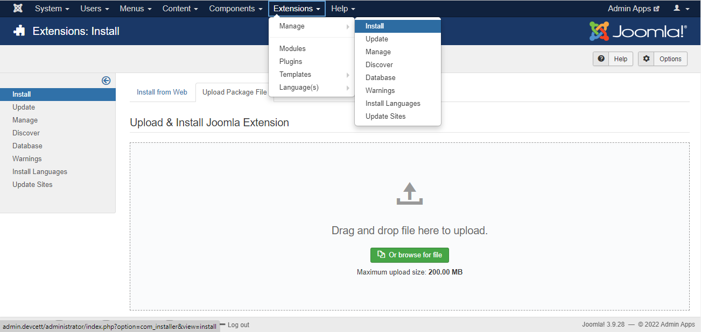
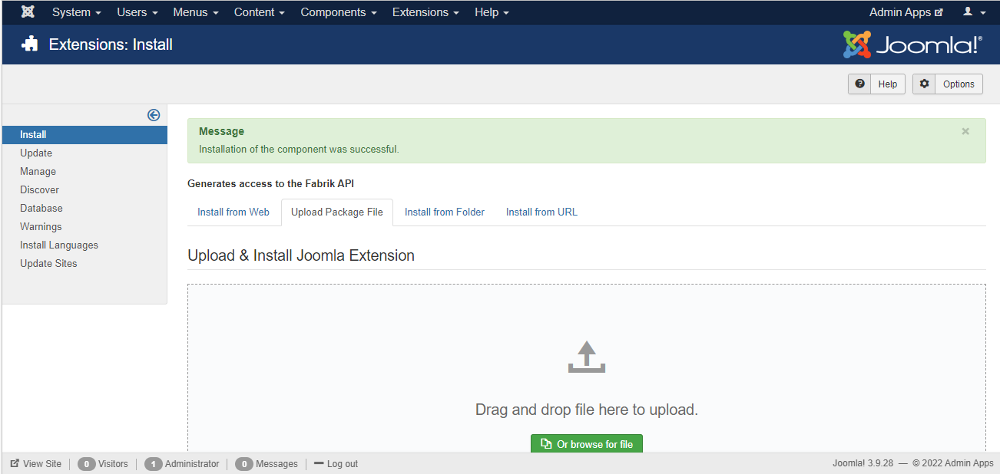
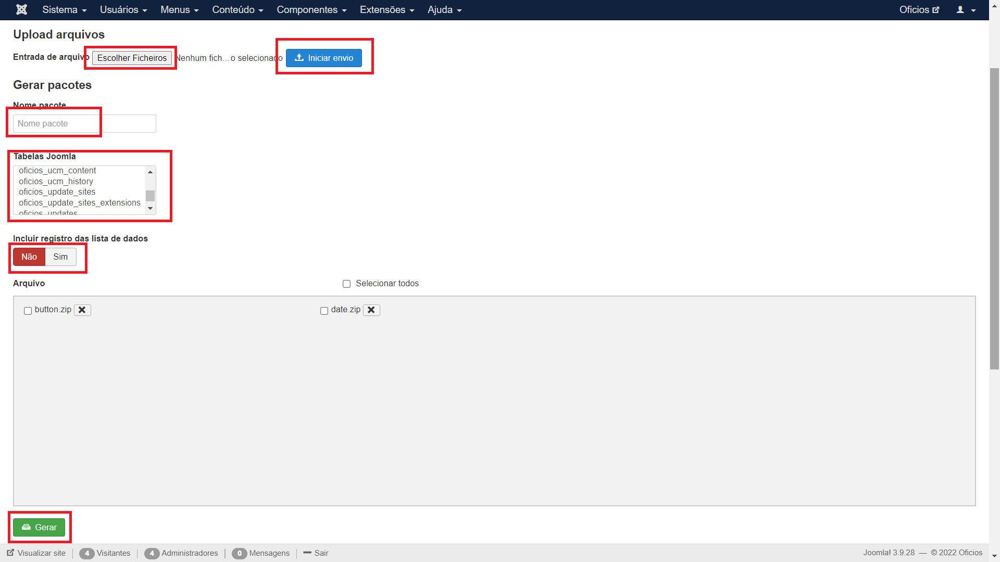
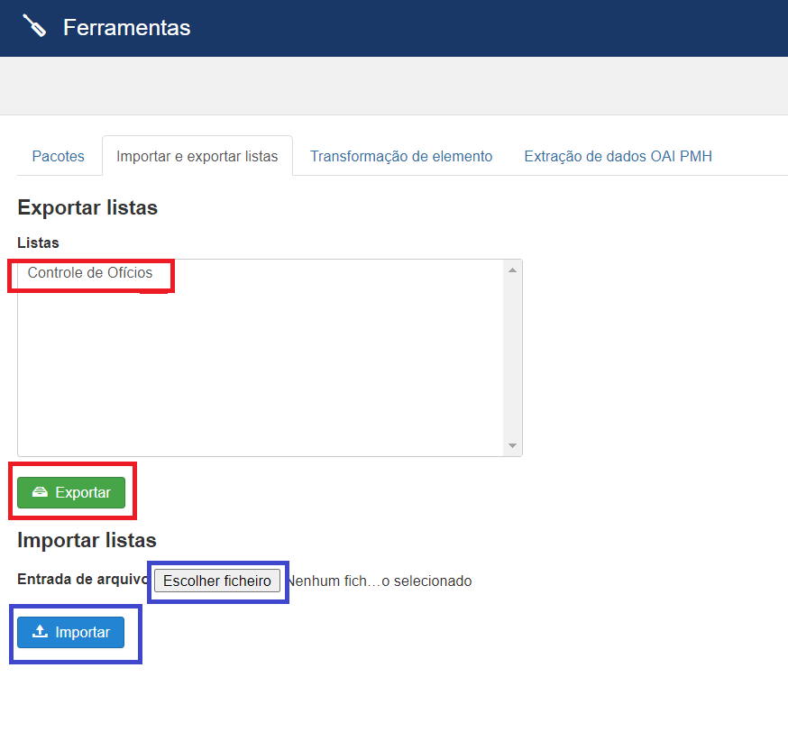
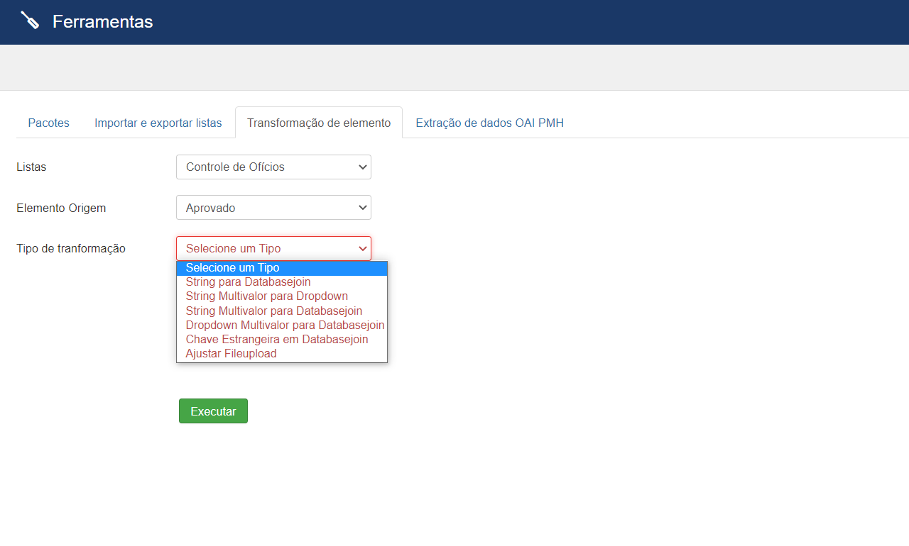
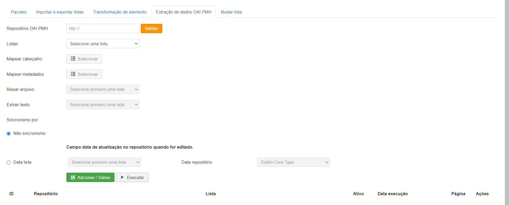

<h1 style="text-align: center"> Administrative tools </h1>

It is a joomla component for use by Fabrik, which has several tabs each with their functions:

<ol>
<li><strong>Packages</strong></li>
<li><strong>Import and Export Lists</strong></li>
<li><strong>Transformation of Elements</strong></li>
<li><strong>OAI PMH Data Extraction</strong></li>
<li><strong>Change list</strong></li>

Tool that changes/changes/renames the name of the fabrik table/list and its created relationships
with the images and joins with some security:

<ul>
<li>Back up the database first for safety.</li>
<li>Put the site down/maintenance down.</li>
</ul> 

Following these instructions will have no problem with the changes.

</ol>
<h2>Installation</h2>

To do so, in your Joomla admin screen, go to Extensions->Manage->Install and click on the Upload Package File tab as in the image below.

After that, just browse the .zip files and drag them to the selection box, if everything happens as expected in the installation, the result should be the following.

<h2>Use</h2>

<h3>Package</h3>
A package with selected tables can be generated and a file uploaded that will be added to the package.

<h3>Import and Export List</h3>
fabrik lists can be exported, along with all elements, forms, groups, plugins and custom settings.
<li>To export you must select one or more lists and click on export, where a json file will be generated, which can be imported by another site.</li>
<li>To import you must select the generated json file in file input and click on import.</li>

<h3>Element Transformation</h3>
Transforms the element type.

<li>You must select the list, source element and type of transformation</li>

<h3>OAI PMH Data Extraction</h3>
Functionality to collect records from institutional repositories and digital libraries.
Some online repositories expose their metadata through the OAI-PMH. This plugin makes it possible to collect this metadata, mapping it to the Omeka data model. The plugin can be used for one-time data transfers or to keep up to date with changes in an online repository.
Atualmente, o plugin é capaz de importar metadados Dublin Core , CDWA Lite e METS . Dublin Core é um padrão reconhecido internacionalmente para descrever qualquer recurso.

© Universidade Federal de Goiás — UFG. All rights reserved.

