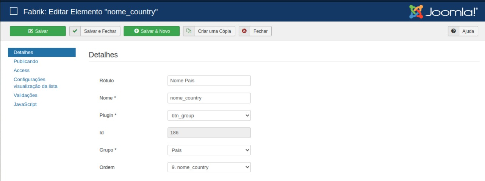
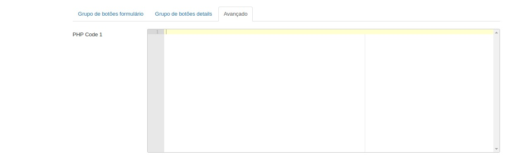
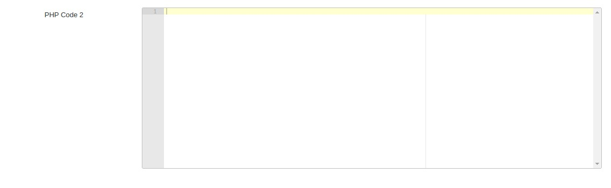

# Botão BTN_GROUP

 

## Conteudo
- [About](#about)
- [Use](#uso)
- [With PHP Code](#withPHPcode)

## About

The `btn_group` plugin comes from the possibility of customizing the loading icon of the buttons. It also allows you to have a button that runs PHP code. The `PHP Code 1` and `PHP Code 2` options should appear for both Form and Details buttons.

## Use

With the plugin properly installed in Joomla, access joomla and choose the element you want to insert this plugin.

    

## With PHP Code
You can create a Button, which when clicked by the user, executes a PHP code.

    

    

