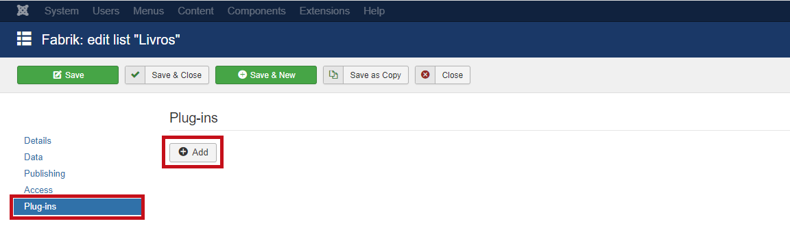
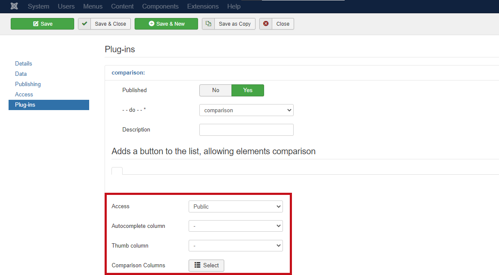

# Fabrik List Comparison 

It is a plugin that performs a very common function on product review/comparison sites, which is to show products in a table that allows you to compare their attributes. Also allowing the user to close the comparison at any time and return to the listing.

### Contents
- [Settings](#Settings)
  - [Adds a button to the list, allowing elements comparison](#adds-a-button-to-the-list-allowing-elements-comparison)

## Settings

To use this plugin, go to **Components > Fabrik > Lists > (enter the list where you want to add the plugin)**. Select the "Plug-ins" option and add a new plugin to the list by clicking on `Add`, as shown in the image below.

The options that appear are part of the configuration of the plugin that will be added.
- `Published`: defines if the plugin is published or not.
- `--do--*` : allows you to select the type of plugin you want, in which case `comparison` will be selected.
- `Description`: is an optional field to describe the functionality of the plugin, being very useful when there are several plugins of the same type.

### Adds a button to the list, allowing elements comparison

- `Access`: defines the level of access to the compare buttons.
- `Autocomplete column`: select the element to be used in the autocomplete field.
- `Thumb column`: selects the element to be considered as a Thumb.
- `Comparison Columns`: selects the elements to be used in the comparison.
