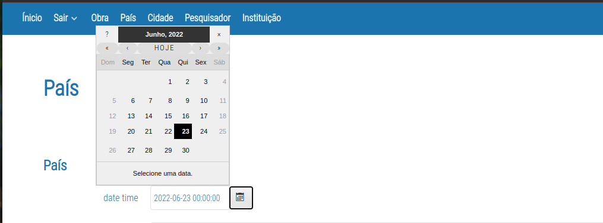
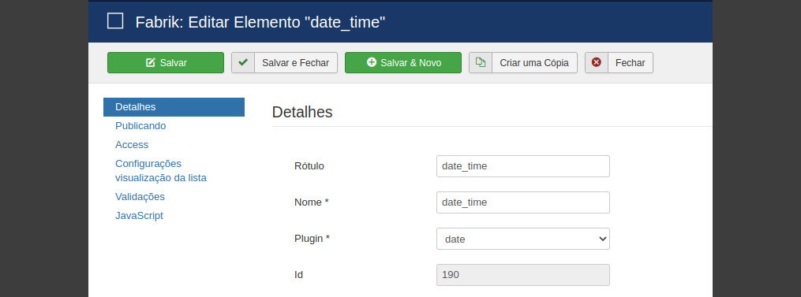
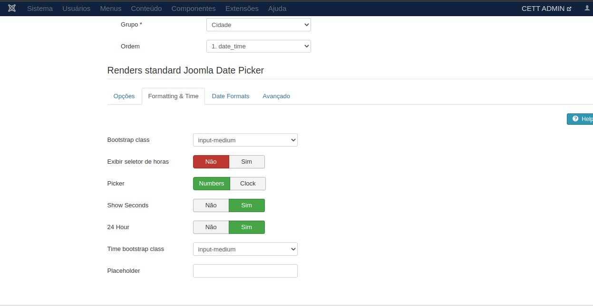
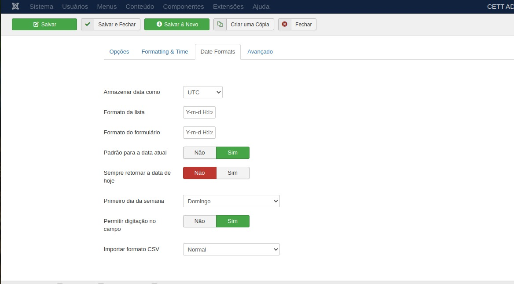
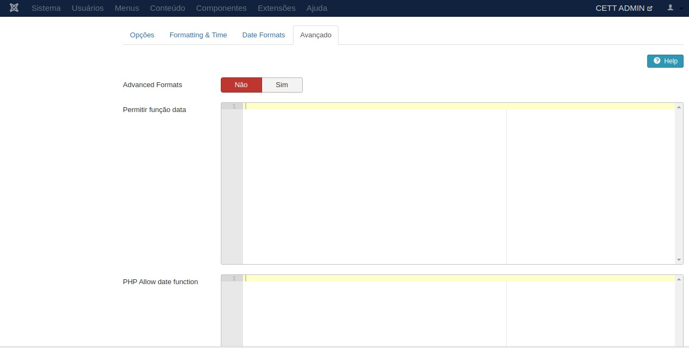

# Date-Master Plugin 

 

## Content

- [About](#about)
- [Use](#use)
- [Customization](#customization)

## About

The Date Master plugin arises from the possibility of customizing the DATA field in forms and fabrick elements. It allows for customization and standardization that will be extremely efficient in inserting the information in the "date" field into the database.

    

# Use

With the plugin properly installed in Joomla, access joomla and choose the element you want to insert this plugin.

<b>PS.:</b> Usually this plugin is used in fields where the date needs to be informed and inserted. Event date, Anniversary etc.

    

# Customization
You can add formatting to the date field.
Below are some examples for this formatting.

    

    

In this field you can add some php or javascript script with custom formatting.

    

