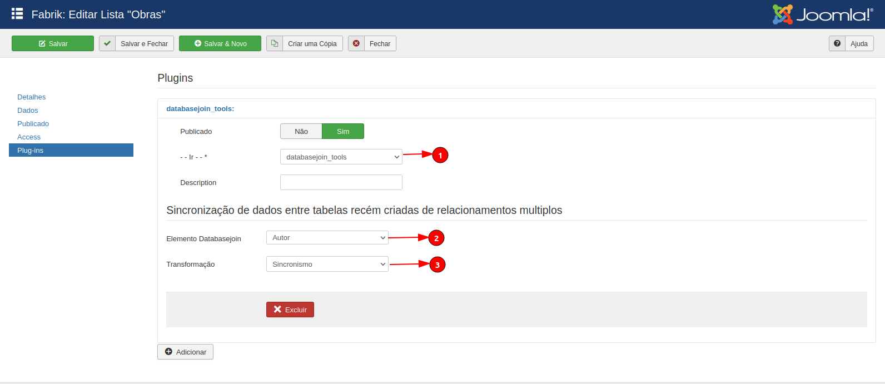

# Fabrik List - Databasejoin Tools 

<h1 align="center">
  
</h1>

 

## 🚀 Specifications

<ul>
    <li>It is an evolution of the Drop2Multi plugin.</li>
    <li>It is an administrative plugin.</li>
    <li>The user makes an NN relationship through the databasejoin between Entity A and Entity B. An NN table is created. Users begin to populate the list.</li>
    <li>Then the need for a relationship between Entity B and Entity A is perceived. Fabrik creates another NN table. It is necessary to pass the records from the other NN table to this new table.</li>
</ul>

## 💻 Tutorial

<b>1</b>: Choose the Databasejoin Tools plugin.

<b>2</b>: The admin configures the databasejoin element. NOTE: in the synchronization field of the databasejoin element, the list to be synchronized that was just created must be configured.

<b>3</b>: The admin chooses the sync role.

  

