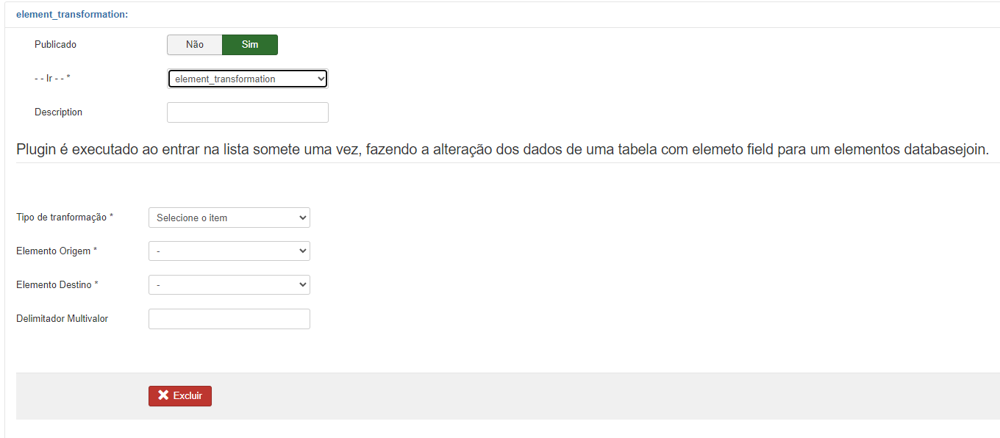
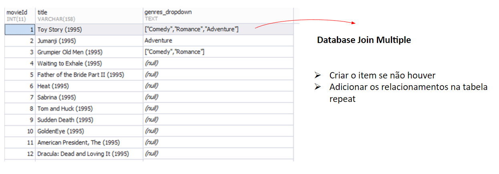

# Element Transformation

  

## About

It is a list plugin used to transform elements of a collection.

There are 2 types of element transformations:

- Transform element of type field to element of type radiobutton or dropdown – <b>Field to Dropdown.</b>

- Transform data type element to relationship element (with or without data sync) – <b>Field/Dropdown/etc to Databasejoin</b>

## Specifications

Among the types of transformations there are 4 possibilities:

### 1. String para Databasejoin 1-N ou NN:

 In this transformation, the user must select the Transformation Type "String to DatabaseJoin".

  

- The admin must choose the element of type field or dropdown or radiobutton or checkbox or any element that contains a string stored in the table field.

- The admin must previously create a relationship between the source list and the linked list, for example: Customer <> City.

 - The algorithm must take the string value of the city field in the source list, look for this string in the other linked list in the field defined by the Label (configured in the databasejoin), from the matching of the strings, find the item ID (cityXYZ) and then store the ID in the new relationship field that was created (_City).

 - So, what was a string in a column will become an ID in the new column created in the DB. After the process is completed the system should automatically unpublish the source element.

- Note: if the relationship configured in the databasejoin is 1-N, the algorithm must use the auxiliary table created to store the IDs. 

- When enabling sync, if the algorithm has a record in the source list with a string in the source element that is not found in the linked list, the system creates a record in the linked list, takes the new ID and stores it.

 

### 2. Multivalue string for Dropdown Multiple:

 In this transformation, the user must select the Transformation Type "String Multivalue to Dropdown", after selecting the Source Element and Destination Element, the element has its type changed in fabrik's internal table: it is changed from Field to DropDown. All different values found in the table for this field are stored in json as dropdown element options. So, if you have state names in this field, each state is automatically added as an option in the converted element dropdown.

  

After the transformation, the admin must access the transformed element and select the multiple selections option.

### 3. String multivalue for DatabaseJoin Multiple

 In this transformation, the user must select the Transformation Type "String Multivalue to DatabaseJoin", after selecting the Source Element and Destination Element, the algorithm converts a string with multiple values separated by | in databasejoin element relationships (drop or multi).

Example of the result in the database:
 

  

 

### 4. DropDown multivalue for DatabaseJoin Multiple

 In this transformation, the user must select the Transformation Type "Dropdown Multivalue to DatabaseJoin", after selecting the Source Element and Destination Element, the algorithm converts a dropdown element (array) into relationships of the multilist databasejoin element.

Example of the result in the database:

 

  

