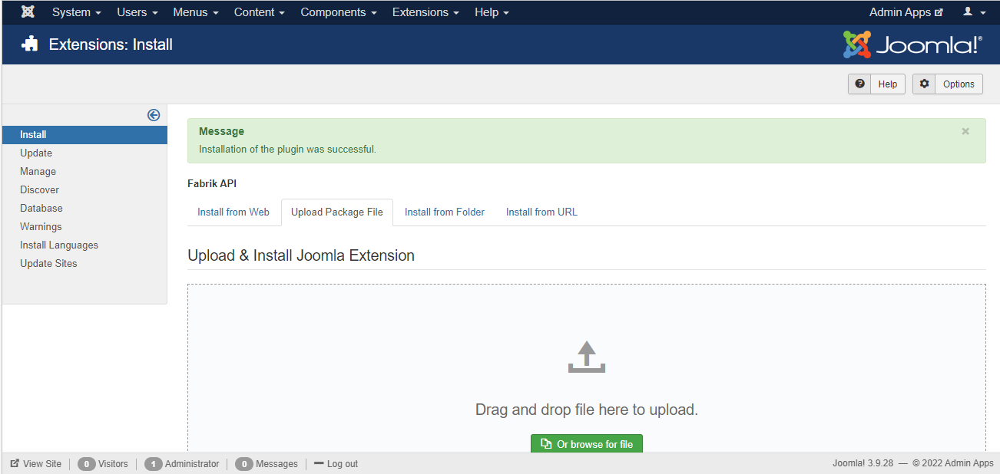
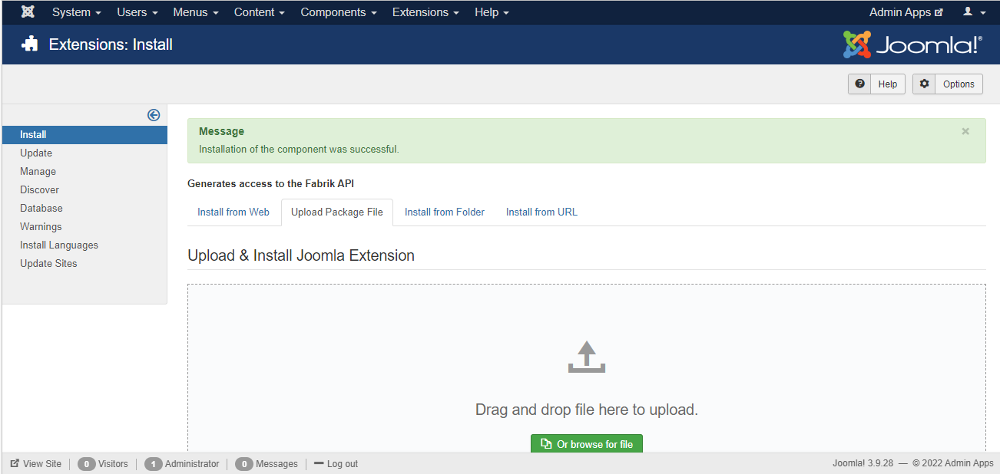
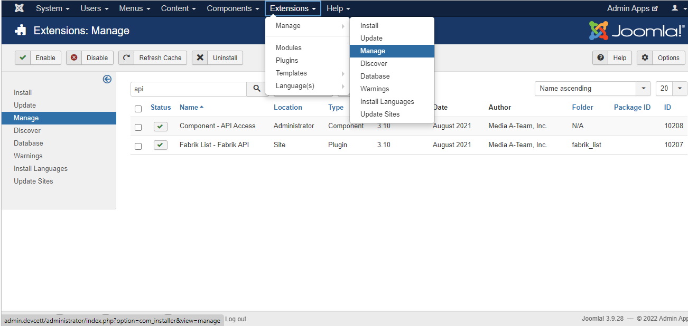
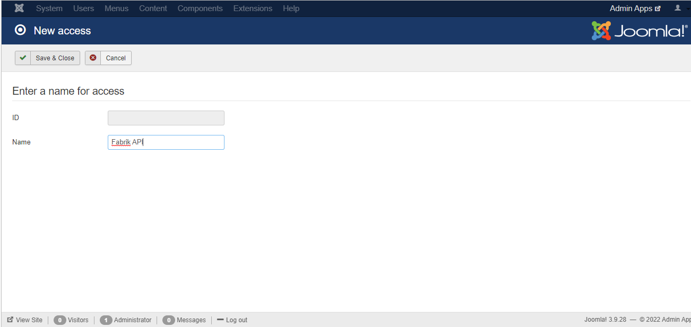
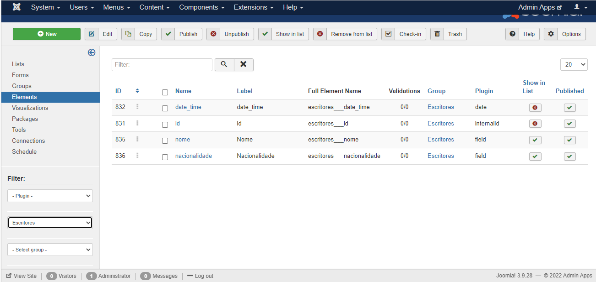

# Fabrik API

## Installation

<p style="text-align: justify">First, you must install the main working plugin, fabrik_api, and its auxiliary component, com_api. To do so, in your Joomla admin screen, go to Extensions->Manage->Install and click on the Upload Package File tab as shown in the image below.</p>


</br>

<p style="text-align: justify">After that, just browse the .rar files of the two necessary extensions and drag them to the selection box, if everything happens as expected in the installation, the result should be the following:</p>

 


## Initial Settings

<p style="text-align: justify">After installation, it is necessary to carry out two steps of configuration and basic verifications for the correct functioning of the API.</p>

</br>

<b>1. Check if the installed extensions are enabled.</b>
<p style="text-align: justify">To do this, go to Extensions->Manage->Manage and in the search tab type "API" and click enter, as in the image below. When the two previously installed components appear, check in the "Status" column if both are enabled, if not, click on the icon to enable them.</p>



</br>

<b>2. Add new API access key</b>
<p style="text-align: justify">In this step, as illustrated in the figure below, it is necessary to go to Components->API Access and click New.</p>


<p style="text-align: justify">A new window will open where the "Name" field must be filled in as the identification of the access key exclusively for the Fabrik API, in this sense, whenever another different API is necessary, it is recommended to create new access credentials. Filling in what is requested, as in the illustration, click on "Save & Close".</p>



<p style="text-align: justify">Then, returning to the previous screen, the new access credential for this API should be seen. The codes in the Client Id and Client Secret columns must always be sent in the requests so that the operation is legitimized.</p>

## Use

<p style="text-align: justify"> With the installation and all the initial configurations performed correctly in the previous steps, the API is already working properly, therefore, it is important to understand how to use it and the basics of how it works.</br>

To perform the standard API request, you must have the following standard initial url format:</p>

<p style="text-align: center">URL = Base(Variable) + Formatting(Fixed)</p>

* <b>Base:</b> https://selecao2.cett.dev.br/index.php?
* <b>Formatting:</b> option=com_fabrik&format=raw&task=plugin.pluginAjax&plugin=fabrik_api&method=apiCalled&g=list&

<p style="text-align: justify">With the url set up as in the previous example, it is now possible to access the plugin, but to make the request, you must send some parameters in the body of the request depending on the type of request to be performed, that is, there are fixed parameters and variables.
In this sense, the body of the request must be in json format with the indices "authentication" and "options" and within each index it must contain the parameters, in json format, with the following indices: </p>  

##### Authentication

* api_key: Value found in the "Client ID" column of step 2 of initial settings. (Fixed)
* api_secret: Value found in the "Client Secret" column of step 2 of initial settings. (Fixed)


##### Options

###### FIXED

* list_id: Integer with the list id of the fabrik to be added to the new record.
* type: It can be "site" to add records to the list or "administrator" to add new columns to the same.

###### POST type

* row_data: Array containing the name of the element in fabrik format as an index and its respective value, being integer or string. To find the full name of the element, go to components->fabrik, then click on Elements in the left corner and filter through the form linked to your desired list in the lower left corner, after that just get the names from the Full Element Name column for each value of column you want to add via API. (type="website")


* g: String containing "element" to add new elements to the desired list. (type="administrator")
* group_id: Value of the group in which the new fabrik element will belong, coherently it must be a group linked to the sent list. (type="administrator")
* plugin: String containing the type of plugin this new added element should be. (type="administrator")
* name: String containing the name of the new element added. (type="administrator")
* label: String contendo a label desejada para o novo elemento. (type="administrator")

###### PUT type
* row_id: Value of the id of the row that must be updated by the request. (type="site")
* row_data: Array containing the name of the element in fabrik format as an index and its respective value, being integer or string. (type="site")
* g: String containing "element" to add new elements to the desired list. (type="administrator")
* element_id: Value of the id of the element that must be updated by the request. (type="administrator")
* label: String containing the new desired label for the element. (type="administrator")

###### DELETE type
* row_id: Array containing the values of the ids of the lines that must be deleted by the request. (type="site")

###### GET type
* row_id: Array containing the values of the ids of the lines that must be returned by the request.(type="site")
* data_type: String containing "list" to return in list format or "table" in table format. (type="site")
* filters: Array containing the name of the element in fabrik format as an index and its respective desired value, being integer or string. (type="site")

<p style="text-align: justify">With all these parameter options it is possible to assemble a request that adds, deletes, updates and inserts new data in fabrik lists, and also adds and updates elements of these lists.</p>

## API return
<p style="text-align: justify">Regardless of the type of request, the standard format of the API response is in json format containing an "error" index, being true in case of error in the request or false in case of success. However, depending on the type of request requested, there is another index in the json called "msg" that has appropriate success and error messages for each request, in addition to the "data" index that contains the data returned by GET and POST in the insertion or selection of rows. from the desired list, in other cases "data" is not returned or returns empty.</p>

## Updates
### GET URL Update

#### Motivation
<p style="text-align: justify">Because the url link to be fetched via GET became too large for simple GETs, it was necessary to modify the way data was received via GET.</p>

#### Modifications
<p style="text-align: justify">Firstly, all changes go through the criterion if the API key parameter exists in the url itself, because if you do not have the code it must work like the original one, in this way, the line of code present before the main change is:</p>

```
