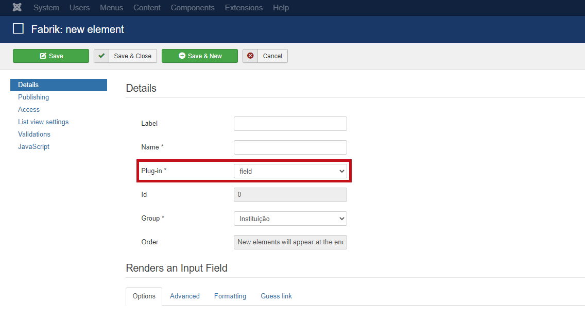
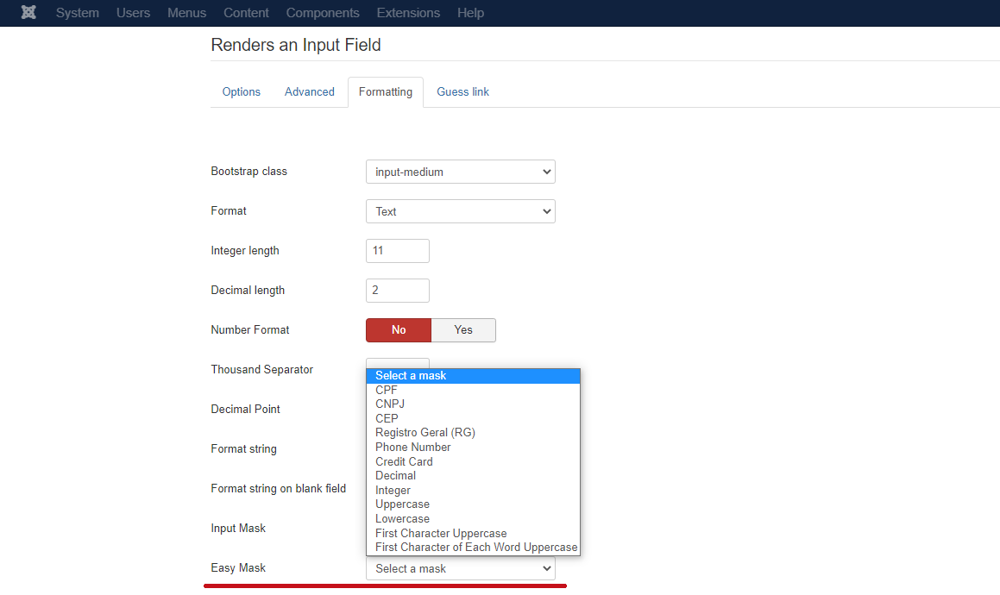
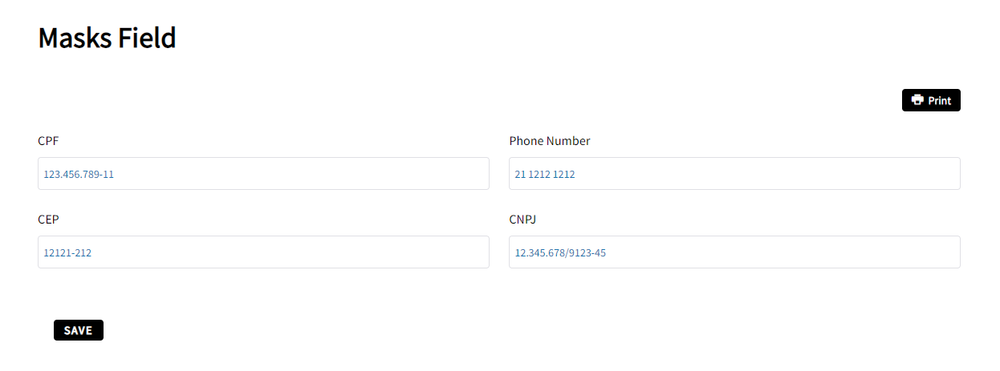

# Element Field 

This plugin is an improvement on the **Field element**, with the objective of standardizing the data entries in the platform records, it was conceived as a formatting and validation plugin associated with the Field element that makes it possible to create a library of masks (standards of formatting) that can be used in the element, such as masks for **CPF, CNPJ, CEP, RG, telephone number, credit card, decimal, integer etc**.

### Contents
- [Settings](#settings)
  - [Renders an Input Field](#renders-an-input-field)
- [Examples](#examples)

## Settings

To use this plugin, go to **Components > Fabrik > Elements > New**, and in `Plug-in` select the `field` option.

### Renders an Input Field

In `Formatting` in the `Easy Mask` field choose the desired mask.

## Examples

The following image demonstrates the use of the plugin for the CPF, CNPJ, CEP and telephone number fields.

