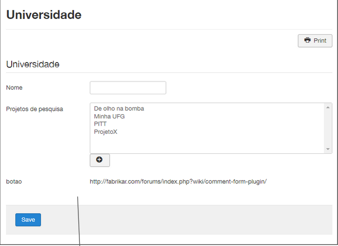

# List Form Plugin

<h1 align="center">
  
</h1>

 

## 🚀 Specifications

<ul>
    <li>The purpose of this plugin is to allow the display of a linked list on the Details Page (a record view page).</li>
     <li>First a target list must be created and a list with a databasejoin linked to it. This represents the relationship below:</li>
</ul>

  

## 💻 Tutorial

<b>1</b>: It doesn't show anything in the ADD/EDIT Form.

  

<b>2</b>: After the last element of the record it shows a list of comments and a form to add a new comment.

  

<b>3</b>: Display in the record view of the target list, the List with the databasejoin filtered by the ID of the viewed record.

  

