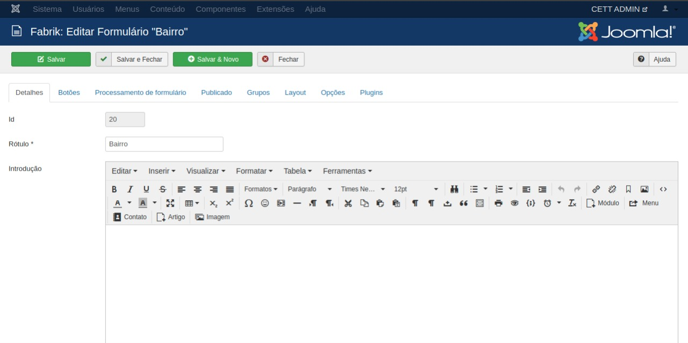
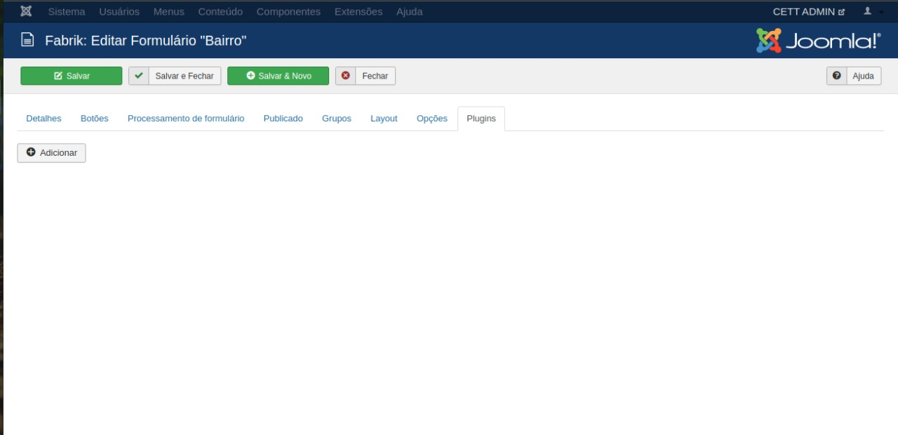
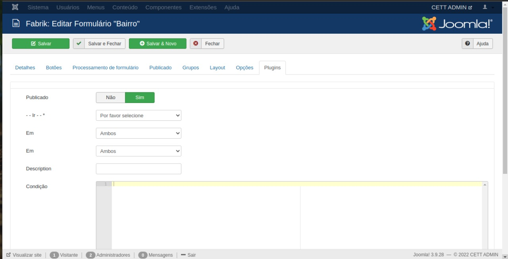
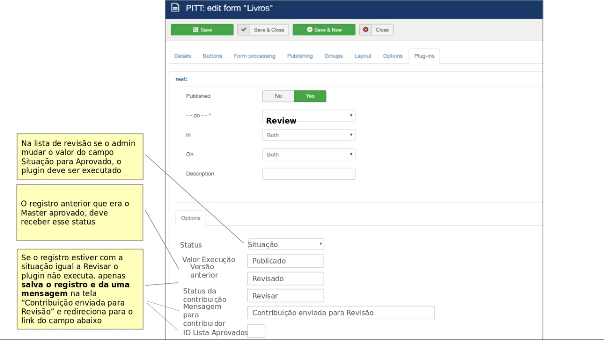
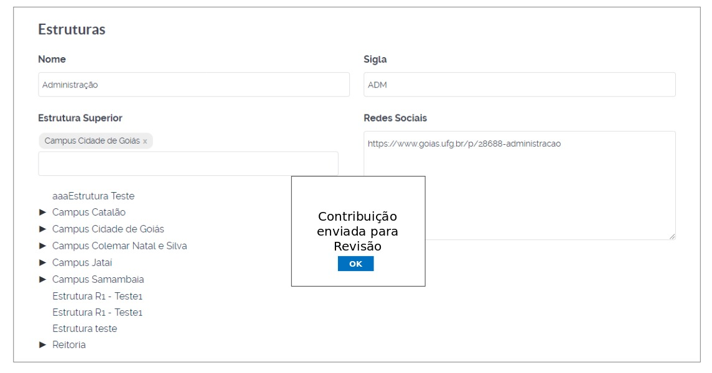

# Plugin Review

 

## Content

- [Plugin](#plugin)
- [Database Collaboration](#collaboration)

## Plugin

The Form Review plugin. How to use and add it to the form.

### Access the form you want to add it to and click on the "Plugin" tab

    

### Click on the "Add" button

    

### Plugin Settings

    

    <h1>Database Collaboration</h1>

- <b>Plugin Review when running:</b>
    - Copy master record id to id_master field
     - Change master record status to Revised
     - Replace in the (original) master record your ID with a new ID (CAUTION DOING THIS THROUGH SQL)
     - Replace in all repeat tables the relationships changing the ID of the record that was master by the new ID
     - Replace in all tables repeat the relationships by changing the ID of the candidate record approved by the ID_master
     - Replace your ID with ID_master in the approved candidate record (Just one update)

    

    

