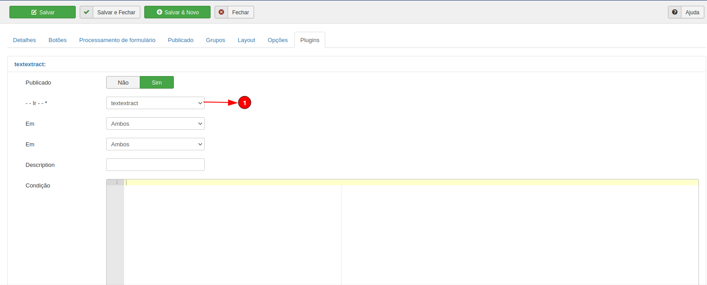
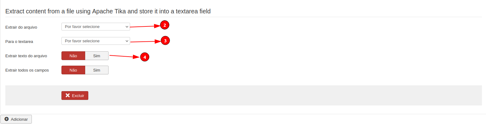

# Fabrik Plugin - Textextract

<h1 align="center">
  
</h1>

 

## 🚀 Specifications

<ul>
    <li>Extracts the txt text from a word or pdf file (this allows the list search to find a record).</li>
     <li>Allows the plugin to capture the HTML view of the record and save it in a field of the record itself to be used in the search.</li>
     <li>Today the general joomla search and the list CANNOT find the records that are sorted through the databasejoin element (because they are related Ids in the auxiliary table called repeat). With that all the words will be in the same field facilitating the search.</li>
</ul>

## 💻 Tutorial

<b>1</b>: Choose the Textextract plugin.

  

 

<b>2</b>: Indicate the file that the text will be extracted from.

<b>3</b>: New function that, if enabled, adds the html along with the text extracted from the file or saves only the html in the field defined below.

<b>4</b>: If enabled, it executes the current functions of the plugin, otherwise it does not run anything from the current plugin.

  

