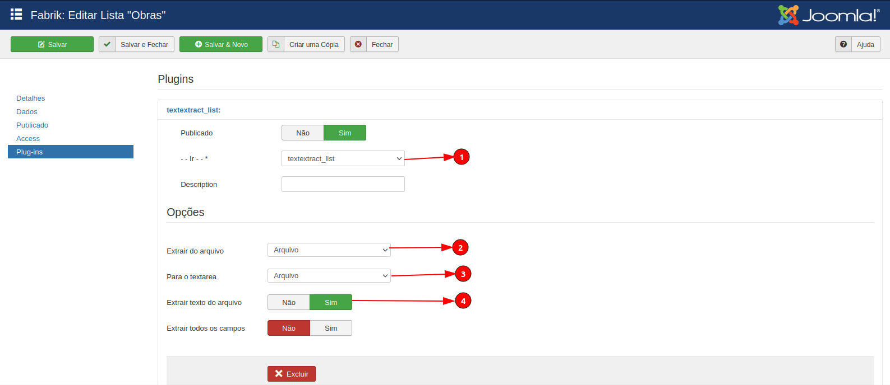

# Text Extract List

<h1 align="center">
  
</h1>

 

## 🚀 Specifications

<ul>
    <li>Performs extraction for all records in the list.</li>
     <li>This is the list version of the Form Text Extract plugin.</li>
     <li>This new list plugin should do the same thing as the current form plugin, however it extracts the html and text from the file for all records in the list.</li>
     <li>The admin must run it only 1 time. It serves to extract old records from a current list, so new records have their text extracted from the form plugin.</li>
</ul>

## 💻 Tutorial

<b>1</b>: Choose the Textextract plugin.

<b>2</b>: Indicate the file that the text will be extracted from.

<b>3</b>: New function that, if enabled, adds the html along with the text extracted from the file or saves only the html in the field defined below.

<b>4</b>: If enabled, it executes the current functions of the plugin, otherwise it does not run anything from the current plugin.

<b>2, 3 and 4</b>: These are the same settings as the plugin version for the form.

  

