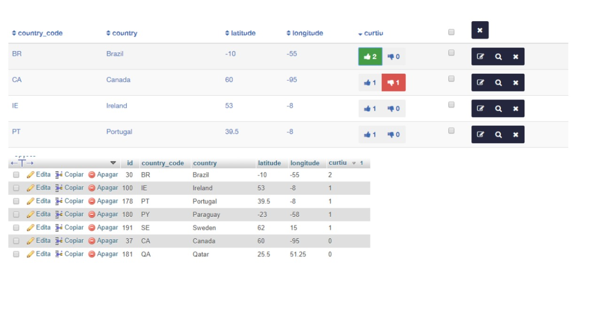
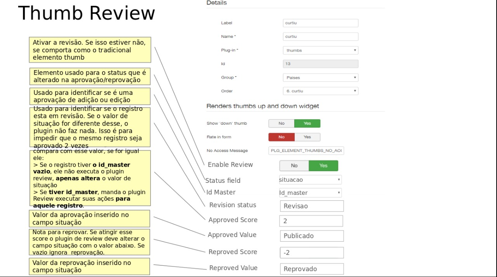

# Thumbs Master Plugin 

 

## Contents

- [Plugin](#plugin)

## Plugin

The Thumb Review plugin.

- The logic remains the same as the user through the suggest plugin, creates a new suggested version of the record to review.

- The review plugin also remains activated and may also continue to work in the after Process of the form.

- The difference is: when a certain record to be reviewed reaches a certain value of positive votes (the sum that is stored in the column of the thumb element) the thumb plugin makes a call to the review plugin by executing it.

This allows Decision Making to be a Democratic Approval performed by the user community rather than being autocratic by a single user.

    

    

